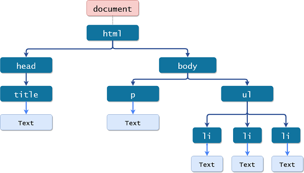

# **JavaScript DOM**
The DOM is a language-neutral programming interface for documents that contain markup such as html and xml.  
Markups are represented as nodes and objects,as a result, other programs and programming languages are able to dynamically access and modify the markup structure, content and style.    
Below is an image of a typical DOM tree:

